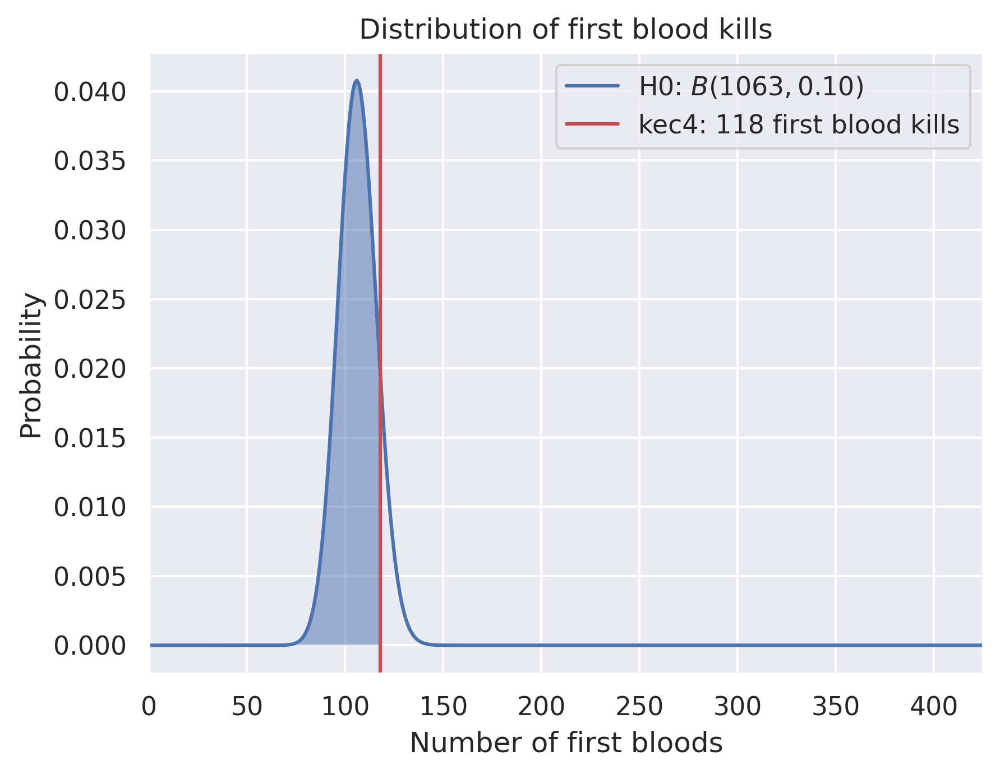

Who is the real first blood king?
=================================

**Not first blood king anymore :-(**

kec4 has 118 first bloods in 1063 games. Assuming a binomial distribution with parameters ``p = 0.1`` and ``n = 1063`` as null hypothesis, the corresponding p value is ``p = 1.268688e-01``.

Last updated: 2020-03-19 17:29:04 UTC

