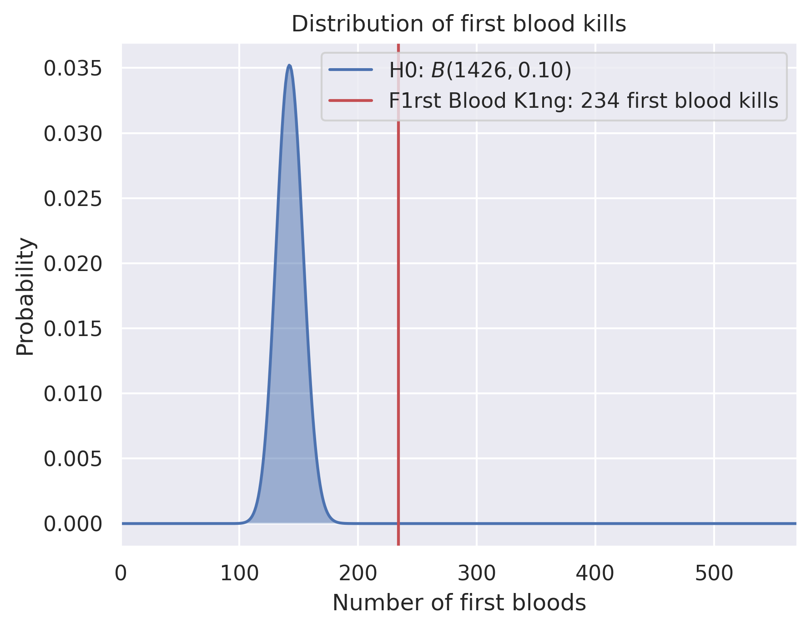

Who is the real first blood king?
=================================

**STILL THE FIRST BLOOD KING!!!**

F1rst Blood K1ng has 231 first bloods in 1417 games. Assuming a binomial distribution with parameters ``p = 0.1`` and ``n = 1417 as null hypothesis, the corresponding p value is ``p = 1.521627e-13``.

Last updated: 2020-03-19 15:03:05

