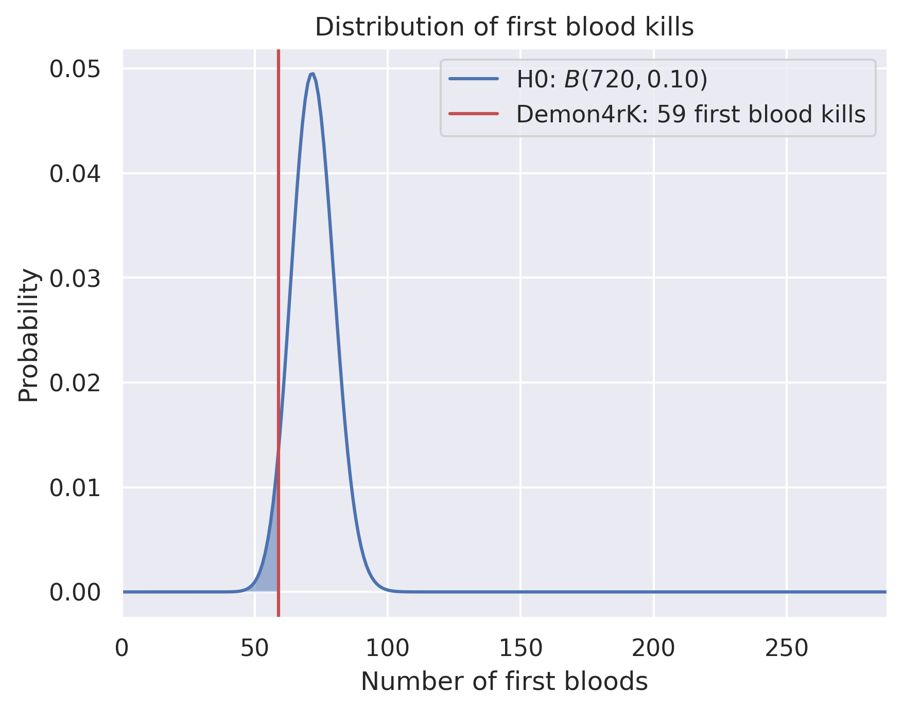
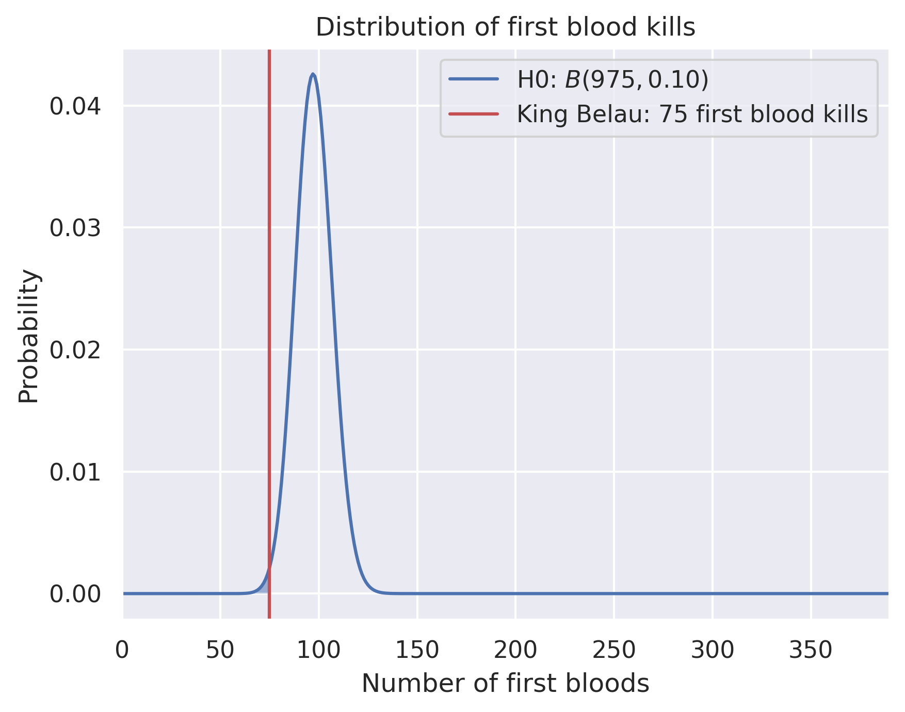

Who is the real first blood king?
=================================

Captain KrümeI
--------------

**not first blood king :-(**

Captain KrümeI has 14 first bloods in 257 games. Assuming a binomial distribution with parameters ``p = 0.10`` and ``n = 257`` as null hypothesis, the corresponding p value is ``p = 9.968739e-01``.

Demon4rK
--------

**not first blood king :-(**

Demon4rK has 59 first bloods in 720 games. Assuming a binomial distribution with parameters ``p = 0.10`` and ``n = 720`` as null hypothesis, the corresponding p value is ``p = 9.564178e-01``.

F1rst Blood K1ng
----------------

**FIRST BLOOD KING!!!**

F1rst Blood K1ng has 234 first bloods in 1426 games. Assuming a binomial distribution with parameters ``p = 0.10`` and ``n = 1426`` as null hypothesis, the corresponding p value is ``p = 5.313239e-14``.

King Belau
----------

**not first blood king :-(**

King Belau has 75 first bloods in 975 games. Assuming a binomial distribution with parameters ``p = 0.10`` and ``n = 975`` as null hypothesis, the corresponding p value is ``p = 9.943964e-01``.

Project Pigeon
--------------

**not first blood king :-(**

Project Pigeon has 72 first bloods in 784 games. Assuming a binomial distribution with parameters ``p = 0.10`` and ``n = 784`` as null hypothesis, the corresponding p value is ``p = 7.928528e-01``.

Tobbelwutz
----------

**not first blood king :-(**

Tobbelwutz has 20 first bloods in 346 games. Assuming a binomial distribution with parameters ``p = 0.10`` and ``n = 346`` as null hypothesis, the corresponding p value is ``p = 9.981243e-01``.

Yolomichel
----------

**not first blood king :-(**

Yolomichel has 99 first bloods in 969 games. Assuming a binomial distribution with parameters ``p = 0.10`` and ``n = 969`` as null hypothesis, the corresponding p value is ``p = 4.265509e-01``.

dergeraetx
----------

**not first blood king :-(**

dergeraetx has 16 first bloods in 378 games. Assuming a binomial distribution with parameters ``p = 0.10`` and ``n = 378`` as null hypothesis, the corresponding p value is ``p = 9.999899e-01``.

kec4
----

**not first blood king :-(**

kec4 has 118 first bloods in 1063 games. Assuming a binomial distribution with parameters ``p = 0.10`` and ``n = 1063`` as null hypothesis, the corresponding p value is ``p = 1.268688e-01``.

Last updated: 2020-03-26 16:55:04 UTC